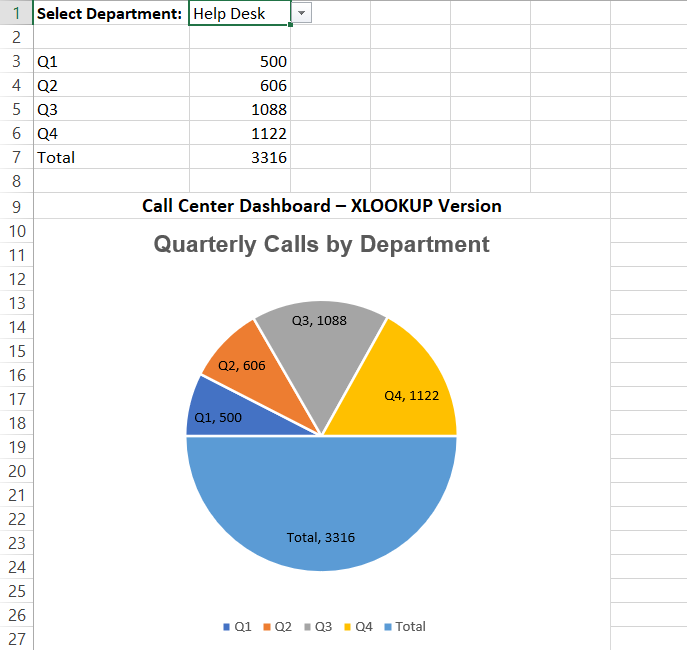

# Excel Call Center Performance Dashboard

## Project Overview
This project presents an **interactive Excel dashboard** designed to analyze quarterly call center performance across different departments.

Users can select a department from a dropdown menu, and the dashboard dynamically updates the chart to display the corresponding quarterly performance.

## Dashboard Preview

## Key Features
- Interactive **department selection** using Data Validation dropdown
- Dynamic data retrieval using **XLOOKUP**
- Automatic chart updates based on user selection
- Clear visualization of quarterly performance metrics

## Tools & Skills Used
- Microsoft Excel
- XLOOKUP
- Data Validation (Dropdown)
- Dynamic Charts
- Dashboard Design

## Dataset
The dataset contains call center performance metrics across four quarters (Q1–Q4) for multiple departments including:

- Help Desk
- Marketing
- IT
- Procurement
- Supply Chain
- Accounting

## How the Dashboard Works
1. Select a department from the dropdown menu.
2. XLOOKUP retrieves the corresponding quarterly values from the dataset.
3. The chart updates automatically to reflect the selected department’s performance.

## Files
- `CallCenterDashboard.xlsx` – Contains both the dataset and the interactive dashboard  
- `dashboard.png` – Screenshot of the interactive Excel dashboard

## Skills Demonstrated
- Excel dashboard development
- Data lookup using XLOOKUP
- Dynamic reporting with dropdown filters
- Data visualization for business reporting

